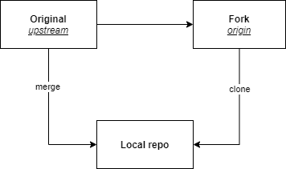

How to update a forked repo and get the last updates from the original project?



## Short answer

On your local CLI of the forked project, link the repo to the original project, fetch changes, do a merge, and finally push to your GitHub repo.

## Long answer  

We can update a forked git repository using one of the many GUIs for git, but we will do it in CLI. 

First under your repository directory:

```sh
git checkout master
```

Shows URLs of remote repositories when listing your current remote connections: 

```sh
git remote -v

|  origin  git@github.com:you/forked-project.git (fetch)
|  origin  git@github.com:you/forked-project.git (push)
```

Enter a remote *upstream* repo to sync with your fork:

```sh
git remote add upstream https://github.com/OriginalOwner/OriginalProject.git
```

Verify:

```sh
git remote -v

|  origin  	git@github.com:you/forked-project.git (fetch)
|  origin  	git@github.com:you/forked-project.git (push)
|  upstream     git@github.com:original-owner/original-project.git (fetch)
|  upstream     git@github.com:original-owner/original-project.git (push)
```

Fetch commits from the upstream repo. This will copy the commits from `master` branch into a local branch called `upstream/master`:

```sh
git fetch upstream

|  remote: Enumerating objects: 789, done.
|  remote: Counting objects: 100% (789/789), done.
|  remote: Compressing objects: 100% (179/179), done.
|  remote: Total 2219 (delta 583), reused 712 (delta 555), pack-reused 1430
|  Receiving objects: 100% (2219/2219), 9.15 MiB | 7.93 MiB/s, done.
|  Resolving deltas: 100% (797/797), completed with 268 local objects.
|  From github.com/original-owner/original-project
|   * [new branch]  b1 -> upstream/b1
|   * [new branch]  b2 -> upstream/b2
|   * [new branch]  b3 -> upstream/b3
|  ...
```

Merge changes from `upstream/master` into `master`:

```sh
git merge upstream/master

|  Updating 27da2af0f..c6eba53f9
|  Fast-forward
|   .gitignore
|   ...
```

Push changes to your repo:

```sh
git push --force-with-lease
|  Total 0 (delta 0), reused 0 (delta 0), pack-reused 0
|  To github.com:you/forked-project.git
|     27da2af0f..c6eba53f9  master -> master
```

## Reference

 https://rick.cogley.info/post/update-your-forked-repository-directly-on-github 