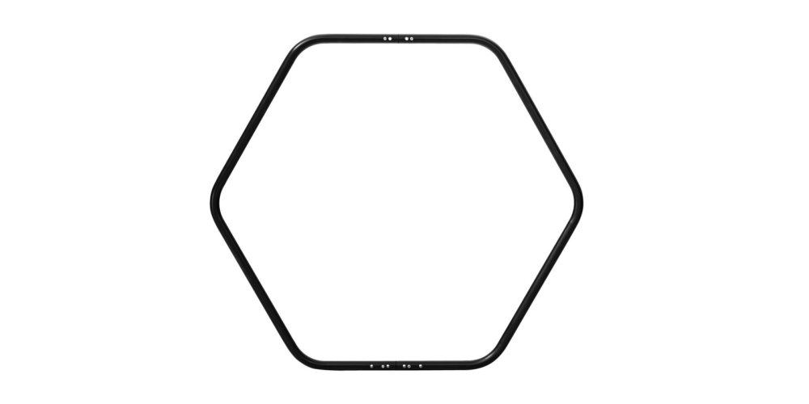
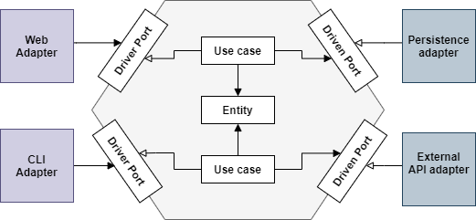

In this article, we'll talk about Hexagonal Architecture, and we’ll build a Java app to illustrate its concepts.

For many years, I worked on projects where the business logic and the technical code (repositories, factories, de/serializers, mappers, proxies, pools, persistence, etc.) were shared/mixed across layers and modules, etc. To sum up, there was no clean/ clear separation of concerns. Each code change was painful & everybody was running away from one project to another. But, the key to a scalable architecture and successful projects is to have the business logic decoupled from all infrastructural concerns. To achieve this goal on a similar project, inversion of control is one of the best practices that can save you. However, there's another pattern that can also help as it promotes decoupling from technology and frameworks. It is Ports and Adapters. If you are thinking, isn't the pattern too old? How it still worth nowadays? Well, good things are timeless. The main idea of Ports & Adapters is to define the structure of an application so that it could be run by different kinds of clients. It is analogous to exposing multiple USB ports on a machine. If you have the best adapter of a keyboard, for example, that fits into the machine's port, you'll be able to use the keyboard. Suppose you have another keyboard with an incompatible adapter. In that case, you will not be able to use it and, I am sure, you will not damage the ports either the machine. That is the main idea of this pattern! Ports & Adapters represent the application as a closed space, which is the same case for the computer. Again, you will not break its ports to plug an incompatible device. This closed area, chosen by Alistair Cockburn for drawing the application, was a hexagon. It has also led to something called Hexagonal Architecture. 

The rest of this text presents my approach of implementing an application in the hexagonal style with Java.



## Hexagonal Architecture?

Hexagonal architecture is an architectural style that **focuses on preserving the business logic decoupled from external concerns and secured inside the hexagon**. There are no layers. As opposed to the common layered architecture style, the components outside the hexagon point towards the objects inside the hexagon. In other words, dependencies are going from user-side and server-side to the business logic.

> The essence of an application is not in its DB and frameworks. Particularly, use cases are the central element, and everything should orbit around it.

In a hexagonal architecture, the value of an application resides in its domain and use cases. So isolating and securing this space is mandatory. Tech stacks come and go, but the business will still the same.

## Principles

As we said before and again, hexagonal architecture aims to isolate the business logic and make it accessible via abstractions called ports and implementations called adapters. Then the code of the application is divided into two large formalized parts:

- hexagon = inside-part = business = core: 
  - Domain model: model or entities hold both state and behavior. They're **pure Java objects** (POJOs) and do not contain any annotation or external dependency. While writing the code, we follow the spontaneous flow of dependencies: we begin coding and evolving in the domain model, and then we go outside.

  - Ports: communications to and from the outside occurs through “ports”. We can distinguish two types of ports:

    > In Java, interfaces are ports. 

    - A **driver port** is a contract that can be invoked by an outsider component. A driver port is implemented by a use case. The driver adapter will use this port to invoke the features inside the business core. 

    > In Java, implementations are adapters. 

    - **A driven port** is a contract that can be invoked by a use case and it is implemented by an outsider component. This contract is designed to fit the needs of the use cases. 

    > The **Inversion of Control** is a powerful tool to replace the implementations without having to modify the hexagon.

  - Use cases: It is a class that controls everything inside the hexagon. It is an explicitly defined way in which an application can be used. A use case of "restoring a forgotten password" would be implemented in `RestoreForgottenPasswordUseCase`. Like the domain model, use cases have no dependency outside the hexagon. 
- The outside: 
  
  - Adapters: the adapters are the implementation of ports. An adapter can implement multiple ports. They make it easy to switch a part of the application. Do you want to switch to a different framework? Write a new adapter. Do you want to expose your use cases via CLI, write a new adapter for it. Do you want to use NoSQL, instead of storing data in relational database? Again, write an adapter for it.



## 3. Hands on

Now, we'll try to apply these principles and build a weather App to store and notify users about temperature. 

### Hello Domain

Let’s begin with our domain class called Temperature:

```java
package io.b.domain.entities;

public class Temperature {

  private final String location;
  private final Integer value;

  public Temperature(String location, Integer value) {
    validate();
    this.location = location;
    this.value = value;
  }

  public void validate() {
    if (location == null || location.isEmpty())
      throw new IllegalArgumentException("Location is required");

    if (value > 100 || value < -100)
      throw new IllegalArgumentException("Temperature value is too high");
  }

  //boilerplate code omitted
}
```

The domain model should have no link or dependency on any specific technology such as annotations from Lombok. 

### 3.2. Ports

We'll introduce some ports and provide a use case of storing and notifying temperature. First, let’s define the driver port to interact with our application: 

```java
package io.b.domain.ports.driver;

import io.b.domain.entities.Temperature;

public interface StoreAndNotifyTemperature {
  void storeAndNotify(Temperature temperature);
}
```

Similarly, we’ll also write two driven ports to interact with the database and the notification system:

```java
package io.b.domain.ports.driven;

import io.b.domain.entities.Temperature;

public interface SaveTemperatureInDb {
  void store(Temperature temperature);
}
```

```java
package io.b.domain.ports.driven;

import io.b.domain.entities.Temperature;

public interface SendTemperatureInNotification {
  void send(Temperature temperature);
}
```

### 3.3. The use case

Next, we'll create a use case and join all the pieces together to manage the execution by implementing the driver port:

```java
package io.b.domain.usecase;

import io.b.domain.entities.Temperature;
import io.b.domain.ports.driven.SaveTemperatureInDb;
import io.b.domain.ports.driven.SendTemperatureInNotification;
import io.b.domain.ports.driver.StoreAndNotifyTemperature;

public class StoreAndNotifyTemperatureUseCase implements StoreAndNotifyTemperature {

  private SendTemperatureInNotification sendTemperatureInNotification;
  private SaveTemperatureInDb saveTemperatureInDb;

  public StoreAndNotifyTemperatureUseCase(
      SendTemperatureInNotification sendTemperatureInNotification,
      SaveTemperatureInDb saveTemperatureInDb) {
    this.sendTemperatureInNotification = sendTemperatureInNotification;
    this.saveTemperatureInDb = saveTemperatureInDb;
  }

  @Override
  public void storeAndNotify(Temperature temperature) {
    saveTemperatureInDb.store(temperature);
    sendTemperatureInNotification.send(temperature);
  }
}
```

### 3.4. Adapters

To accomplish our use case, we provided an in-memory implementation of the driven ports: 

```java
package io.b.infrastructure.mail;

import io.b.domain.entities.Temperature;
import io.b.domain.ports.driven.SendTemperatureInNotification;

import java.util.List;
import java.util.logging.Logger;

import static java.lang.String.format;

public class SendEmailInMemory implements SendTemperatureInNotification {

  @Override
  public void send(Temperature temperature) {

    // use a service to get the list of the subscribers
    List<String> subscribers = List.of("world");

    subscribers.forEach(subscriber -> {
      Message messageToSend = new Message(temperature.toString(), subscriber);
      // send an email using an external service
    });
  }
}
```

```java
package io.b.infrastructure.repository;


import io.b.domain.entities.Temperature;
import io.b.domain.ports.driven.SaveTemperatureInDb;

import java.util.HashMap;
import java.util.Map;
import java.util.logging.Logger;

import static io.b.infrastructure.repository.TemperatureDbMapper.toTemperatureEntity;
import static java.lang.String.format;

public class TemperatureDbInMemory implements SaveTemperatureInDb {

  private Map<String, TemperatureEntity> temperatureMap = new HashMap<>();
  // or use JpaRepository for eg. to to store the TemperatureEntity

  @Override
  public void store(Temperature temperature) {
    TemperatureEntity temperatureEntity = toTemperatureEntity(temperature);
    temperatureMap.put(temperature.getLocation(), temperatureEntity);
  }
}
```

For each adapter, we provided objects to use and mappers to ensure the conversion of objects from domain object to the infrastructure. 

### 3.5. App bootstrap

In our case, we will expose the weather app through a REST API. This class `UpdateTemperatureResource` represents the App. It instantiates objects for each adapter and injects instantiated dependencies. We didn't use CDI annotations to keep things simple, but we can use them only on infrastructure packages. The domain MUST stay technology *agnostic*.

```java
package io.b.app.rest;

import io.b.domain.ports.driver.StoreAndNotifyTemperature;
import io.b.domain.usecase.WeatherService;
import io.b.infrastructure.mail.SendEmailInMemory;
import io.b.infrastructure.repository.TemperatureDbInMemory;

import javax.ws.rs.Consumes;
import javax.ws.rs.POST;
import javax.ws.rs.Path;
import javax.ws.rs.Produces;
import javax.ws.rs.core.MediaType;
import javax.ws.rs.core.Response;

import static io.b.app.rest.TemperatureRestMapper.toTemperature;

@Path("/weather")
public class TemperatureResource {

  private final StoreAndNotifyTemperature useCase;

  public TemperatureResource() {
    useCase = new StoreAndNotifyTemperatureUseCase(
        new SendEmailInMemory(), 
        new TemperatureDbInMemory()
    );
  }

  @POST
  @Consumes(MediaType.APPLICATION_JSON)
  @Produces(MediaType.APPLICATION_JSON)
  public Response update(UpdateRequest request) {
    useCase.storeAndNotify(toTemperature(request));
    UpdateResponse response = new UpdateResponse(request.getLocation());
    return Response.ok(response).build();
  }

}
```

The structure of the project ends up looking like: 

```sh
src
├───main                                                          
│   ├───java                                                      
│   │   └───io
│   │       └───b
│   │           ├───app
│   │           │   ├───cli
│   │           │   ├───job
│   │           │   └───rest
│   │           │         TemperatureRestMapper.java
│   │           │         UpdateRequest.java
│   │           │         UpdateResponse.java
│   │           │         TemperatureResource.java
│   │           ├───domain
│   │           │   ├───entities
│   │           │   │       Temperature.java
│   │           │   ├───ports                      
│   │           │   │   ├───driven
│   │           │   │   │       SaveTemperatureInDb.java
│   │           │   │   │       SendTemperatureInNotification.java
│   │           │   │   └───driver
│   │           │   │           StoreAndNotifyTemperature.java
│   │           │   └───usecase
│   │           │           StoreAndNotifyTemperatureUseCase.java
│   │           └───infrastructure
│   │               ├───mail
│   │               │       Message.java
│   │               │       SendEmailInMemory.java
│   │               └───repository
│   │                       TemperatureDbInMemory.java
│   │                       TemperatureDbMapper.java
│   │                       TemperatureEntity.java
```

The weather app can be exposed over a REST API, scheduled jobs or CLI. So the application could be be driven by users at first, and machines at a second time.

To keep things simple, we kept all the code the inside and the outside parts of code in the same project but separated in different packages. 

### 5. Observations

You can find other naming conventions for ports, adapter, and domain. 

- driven port = in port = inbound port = left = SPI
- driver port = out port = outbound port = right = API
- business logic = domain = core

Interfaces, in general, allow decoupling implementation from the component that uses it, following the [Dependency Inversion Principle](https://martinfowler.com/articles/dipInTheWild.html). This way, instead of high-level modules (domain) depending on low-level modules (adapters), both will depend on abstractions.

Extendibility, following the Open-closed Principle. Adding another implementation, such as an adapter for `OpenWeather`, does not require modifying the domain code.

### 6. Conclusion

In this article, we’ve seen how to implement an application using Hexagonal Architecture in Java.

### 7. References

- [Get Your Hands Dirty on Clean Architecture, Tom Hombergs](https://www.packtpub.com/programming/get-your-hands-dirty-on-clean-architecture) 
- [Happy Town, Céline Gilet](https://github.com/celinegilet/happy-town) 