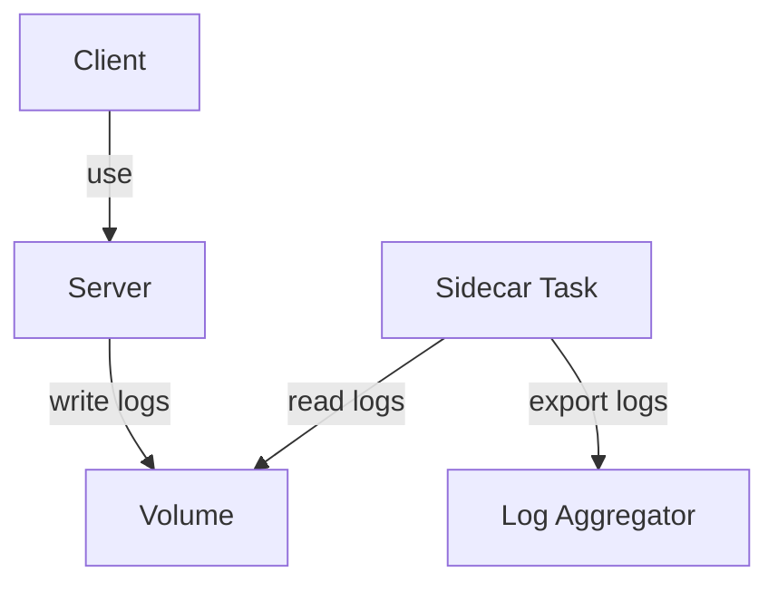

In a distributed architecture, an component of an application should do only one job and do it well. But sometimes, it needs to ship some extra tasks to fulfill some required tasks that are not related to the core business. For example, a microservice needs to provide observability, monitoring, logging, configuration, circuit breakers, etc. All these features can exist inside each microservice. 

Packaged with the same application, these tasks can cause serious problems. Indeed, being dependent and use the same resources of the main component can cause an outage of service if something went wrong. Moreover, we need to implement them using the same technologies as the main component. Yet, a specific technology can not be used to solve all the problems.

The idea is to co-locate a cohesive set of tasks with the main application, but without grouping them together inside the same component.

The sidecar pattern is what we need to solve this problem!

## Solution

In the real world, a sidecar service is attached to a motorcycle to provide more spaces for additional passengers. Similarly, in the software industry, a sidecar is attached to an application to extend it, often without the main application's knowledge.

> The sidecar pattern is usually applied with containers and is referred to as a sidecar container or sidekick container.

A sidecar service goes wherever the parent application goes. It shares the same lifecycle as the main application. Also, it supports the services that are deployed with the primary application.

## Examples

- Providing TLS termination to secure inter-Pod traffic
- Managing application configuration/variables
- Providing operational capabilities such as rate-limiting
- Sync files on a web server with a Git repository
- Logging

Let's consider a server running and produce logs. These logs are helpful for developers and support teams to resolve any problem. Still, they are not critical to be managed in the same volume as other core business files. Moreover, we need to make these logs available on a log aggregator. So with the sidecar pattern, we can deploy a second container doing this job only. The server processes the HTTP request, and the log sidecar ships the logs. 



Here's a definition of resources to use inside Kubernetes for the presented example:

```yaml
apiVersion: v1
kind: Pod
metadata:
  name: server-app
spec:
  volumes:
    - name: shared-logs
      emptyDir: {}

  containers:
    - name: spring-boot-server
      image: spring-boot-server
      volumeMounts:
        - name: shared-logs
          mountPath: /var/log

    - name: sidecar-container
      image: busybox
      command: ["sh","-c","while true; do cat /var/log/access.log /var/log/error.log; sleep 30; done"]
      volumeMounts:
        - name: shared-logs
          mountPath: /var/log
```

The main container is a Java application container storing its logs on a volume `/var/log`. The sidecar reads and outputs the content of log files every 30 seconds. But in real-world applications, we can sue other tools or agents to deal with the logs.

## Issues and Considerations

- Containers are particularly well suited to the sidecar pattern
- Prefer configurations to deploy and use sidecars components
- Verify if the sidecar task is more efficient as a separated task 

## Recommendations

Adopt if:

- The application uses different technologies
- A component of the application is external
- Share the same lifecycle of the main application
- The sidecar needs to be in the same environment as the application

Avoid if:

- Use inter-process communications
- Small application

In this post, we've introduced the sidecar pattern. With this pattern, a sidecar container augments and extends an application to add functionality. Also, there are several patterns to know more about, like the Ambassador Pattern and the Adapter Pattern.